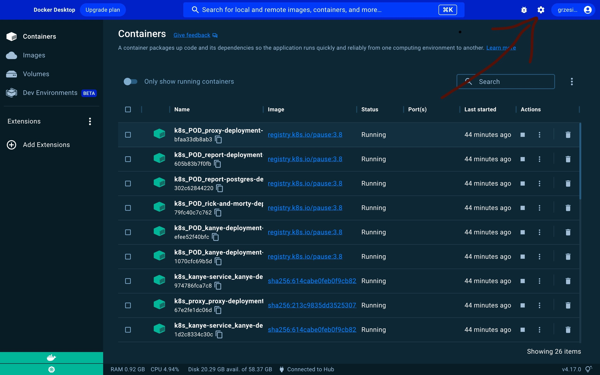
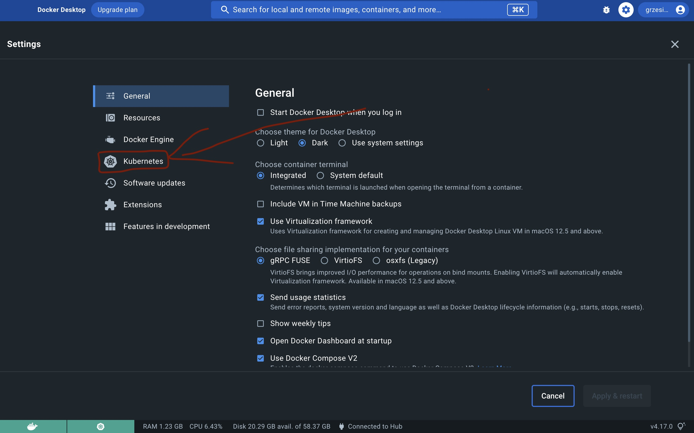
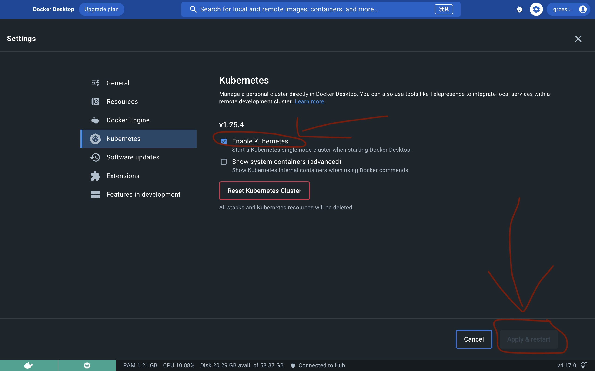

# microservices-deployment

Kubernetes project tasked with deploying and updating the application https://github.com/grzegorz-oladele/microservcies-training
on test and production environment.

## Requirements
### 1. Run Docker Desktop application
### 2. Check if you create a kubernetes cluster on your local machine by Docker

### 3. Check if you have helm on your local machine
command: helm version \
if you don't have hel on your local machine follow to instruction -> https://helm.sh/docs/intro/install/
# How to deploy application?
1. In dev environment \
a. create dev namespace ->  kubectl create namespace dev
b. use command -> helm install dev-release microservices-deployment/ --values microservices-deployment/values.yml -f microservices-deployment/values-dev.yml -n dev
c. use command if you need update your kubernetes cluster -> helm upgrade 
2. In test environment \
a. create dev namespace kubectl create namespace test
b. use command helm install test-release microservices-deployment/ --values microservices-deployment/values.yml -f microservices-deployment/values-test.yml -n test

*Any changes regarding project configuration should be made in values*.yml files

HERE WE GO!
Now you can test application in your local kubernetes cluster on http://localhost:8100/api/**
Full microservices-deployment documentation you can find in project repo -> https://github.com/grzegorz-oladele/microservcies-training
